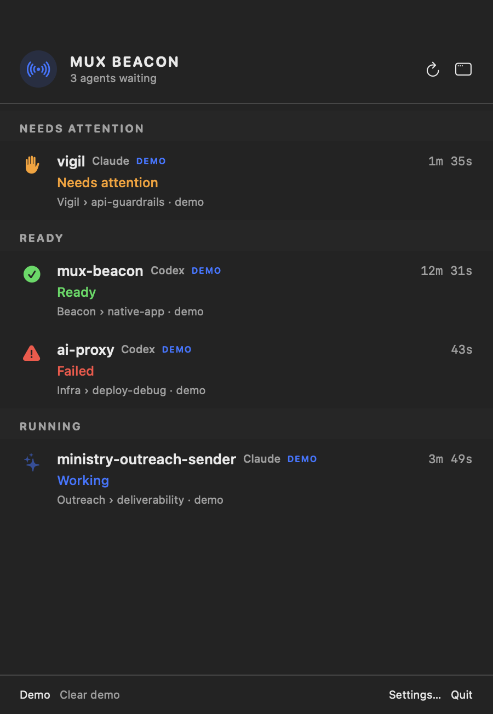
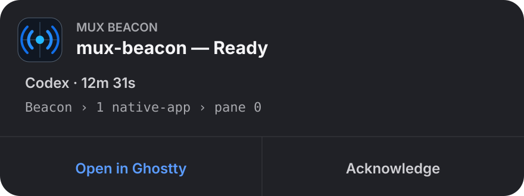
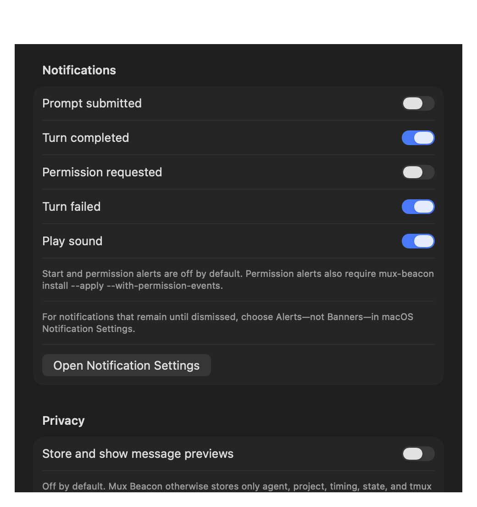
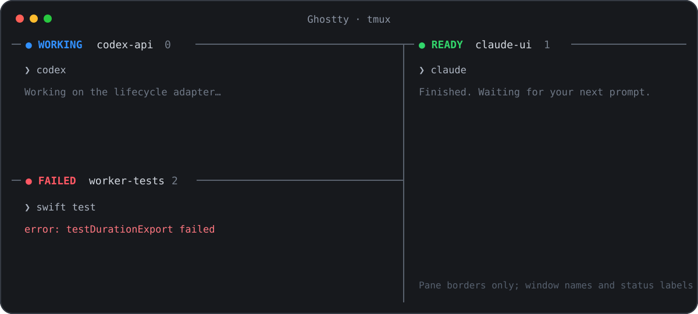

# Mux Beacon

Know when terminal agents need you—and get back to the exact tmux target.

Mux Beacon is a native macOS menu-bar inbox for Claude Code and Codex. It uses first-class lifecycle hooks, records local turn duration, shows optional pane-border badges, and makes completion notifications actionable without taking over your tmux window names.



## Why it exists

A busy tmux setup can hide finished work across sessions and windows. Mux Beacon turns each agent turn into a small lifecycle:

```text
prompt submitted → working → ready / failed
                         └→ needs attention (optional)
```

- `UserPromptSubmit` records the start immediately; its notification is opt-in to avoid noise.
- Completion and failure notifications contain agent, project, duration, and `session › window`.
- Clicking **Open in Ghostty** targets the originating tmux client and focuses the captured Ghostty terminal.
- **Acknowledge** clears the unread state; **Mark time logged** is available in the inbox.
- `PermissionRequest` is supported but its notification is off by default.
- Prompts, commands, and final answers are not stored unless previews are explicitly enabled.

## Requirements

- macOS 13 or newer
- tmux 3.2 or newer
- Claude Code with hooks, or Codex CLI with hooks
- Ghostty 1.3+ for exact window/tab focus; other terminals still receive the inbox and tmux metadata

## Install locally

```sh
git clone https://github.com/Lukeesec/mux-beacon.git
cd mux-beacon
./scripts/install-local.sh
mux-beacon install
mux-beacon install --apply
```

The app installs into `/Applications` when writable, otherwise `~/Applications`, and registers with Launch Services. Finder can open it directly; `mux-beacon gui` is the reliable launcher for local ad-hoc builds that Spotlight has not indexed yet.

The first `install` is a dry run. Applying the installation:

- adds owned handlers to `~/.claude/settings.json`;
- adds owned handlers to `~/.codex/hooks.json`;
- does **not** replace Codex's legacy `notify` command or rewrite `config.toml`;
- writes timestamped backups before every change.

Codex asks you to review new hooks once. Open `/hooks` and trust the Mux Beacon definitions.

Permission events are deferred by default. Users who want them can install the adapter explicitly and then enable its notification in Settings:

```sh
mux-beacon install --apply --with-permission-events
```

Allow notifications when macOS prompts. In **System Settings → Notifications → Mux Beacon**, choose **Alerts** instead of **Banners** if notifications should remain until dismissed; macOS owns this setting, so apps cannot enforce it. To enable exact Ghostty focus, allow Mux Beacon to automate Ghostty under **System Settings → Privacy & Security → Automation**.

## Open the GUI

Mux Beacon is primarily a menu-bar app. Click its beacon icon in the macOS menu bar, open it from Finder or Spotlight when indexed, or run:

```sh
mux-beacon gui
```

Launching the app directly opens a standalone inbox window. Background hook launches remain unobtrusive.

## Try it without touching hook configuration

```sh
mux-beacon demo
mux-beacon test ready --source codex
mux-beacon status
```

The app and demo require no tmux restart. Hooks may require a new or reloaded agent process.

Mux Beacon is hook-driven rather than a process scanner. It begins tracking an agent when a hook-enabled prompt is submitted; it cannot reconstruct turns that were already running before installation. Merely launching Claude or Codex does not produce a start event.

## Notification content



macOS renders the project and state as the bold title, with agent and duration beneath it and the tmux route in the body. It controls final layout, truncation, persistence, and Focus/DND delivery. Routing details live in hidden notification metadata as an opaque event ID.

Demo records are marked `DEMO` and intentionally have no live jump target. The GUI keeps sample-data controls out of the normal workflow; remove samples with `mux-beacon clear-demo`.

## Defaults



Completion and failure alerts are on. Start and permission alerts are off. Change them in the GUI or from the CLI:

```sh
mux-beacon notifications status
mux-beacon notifications start on
mux-beacon notifications start off
mux-beacon notifications all off
```

## Disable or remove Mux Beacon

Choose the level you want:

```sh
# Silence every notification but keep recording turns in the inbox
mux-beacon notifications all off

# Stop collecting new events by removing only Mux Beacon's agent hooks
mux-beacon uninstall --apply

# Remove hooks and move the app to Trash; local history is retained
./scripts/uninstall-local.sh
```

## tmux views



The state appears at the left of each pane's top border—blue `● WORKING`, green `● READY`, yellow `● ATTENTION`, or red `● FAILED`—followed by the existing pane title and pane number. The illustration uses a neutral theme; tmux renders it using your terminal's font and background. These badges are most useful when a window is split into panes; desktop notifications and the menu-bar inbox provide visibility across hidden windows and sessions.

```sh
mux-beacon tmux popup
mux-beacon tmux enable-badges
mux-beacon tmux disable-badges
```

Badges are opt-in. Mux Beacon saves the exact existing `pane-border-status` and `pane-border-format`, changes neither `window-status-format` nor window names, and restores the saved values when disabled.

## Time records

Turn duration is measured from prompt submission until completion or failure.

```sh
mux-beacon export --format json --output mux-beacon-time.json
mux-beacon export --format csv --output mux-beacon-time.csv
```

The core exposes `TimeExportProvider` and `TimeEntryDraft` so a Clockify adapter can be added without changing hook or UI code. Direct Clockify credentials and API calls are deferred from the first release; see [Clockify integration design](docs/CLOCKIFY.md).

## Useful commands

| Command | Purpose |
|---|---|
| `mux-beacon doctor` | Check app, hooks, tmux, Ghostty, and local storage |
| `mux-beacon status` | Show recent activity in the terminal |
| `mux-beacon health` | Retire superseded records and missing tmux targets |
| `mux-beacon gui` | Open the native inbox window |
| `mux-beacon notifications …` | Inspect or change alert preferences |
| `mux-beacon jump-last` | Open the newest unread event |
| `mux-beacon demo` / `clear-demo` | Add or remove anonymized sample data |
| `mux-beacon uninstall --apply` | Remove only Mux Beacon's hook handlers |

## How routing works

Mux Beacon stores stable tmux IDs and the exact server socket. Navigation uses:

```sh
tmux -S <socket> switch-client -c <client-tty> -t <pane-id>
```

Ghostty 1.3 does not expose a terminal TTY, so Mux Beacon captures the focused terminal ID synchronously at prompt submission. Ghostty 1.4 adds TTY/PID properties, allowing direct mapping. Ambiguous or stale routes fail closed instead of switching an arbitrary terminal.

The inbox checks target health every 30 seconds and whenever **Refresh** is clicked. Older active turns on the same tmux target and events whose panes no longer exist are acknowledged as stale and retained under **History** for 7 days. Running and unread records are never removed by history cleanup.

See [Architecture](docs/ARCHITECTURE.md), [Development](docs/DEVELOPMENT.md), and [Troubleshooting](docs/TROUBLESHOOTING.md).

## Privacy and security

- Local-only SQLite database; no telemetry.
- User-only application-support directory and hook backups.
- No approval or denial actions from notifications.
- Opaque event IDs in notification metadata; no shell commands or tmux labels in URLs.
- Hook commands return success without steering the agent.

## License

MIT © 2026 Lukeesec contributors.
