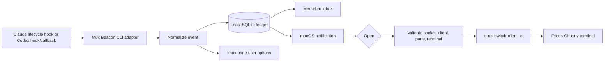

# Architecture

## Event flow

The hook relay is deliberately passive. It reads one documented JSON object, emits only the empty JSON response required by Codex's blocking `Stop` hook, and exits successfully even if local notification plumbing fails.

## Normalized lifecycle

| Provider event | Mux Beacon state | Default notification |
|---|---|---|
| `UserPromptSubmit` | `working` | Off |
| `PermissionRequest` | `needsAttention` | Adapter opt-in; notification off |
| `Stop` | `ready` | On |
| Claude `Stop` with background tasks/crons | `background` | On |
| Claude `StopFailure` | `failed` | On |
| `SessionEnd` before a terminal state | `stale` | Off |

Codex's documented `notify` command supplies `agent-turn-complete` as a completion fallback because some Codex versions do not emit the lifecycle `Stop` hook after each turn. Both inputs normalize to the same `ready` event.

Claude's `prompt_id` and Codex's `turn_id` correlate state changes. When an older provider omits a turn identifier, Mux Beacon updates the newest active turn in that session.

## Stored data

Each event stores provider/session/turn identity, state, project, timestamps, tmux routing metadata, optional Ghostty terminal ID, acknowledgement, and time-log status. User-facing routes emphasize `session › window`; stable pane and client IDs remain private routing metadata. Preview text is discarded before persistence unless the user enables it.

## Routing confidence

- `exact`: stable tmux pane and originating client are known.
- `captured`: Ghostty 1.3 terminal ID was captured while Ghostty was frontmost.
- `ambiguous`: a pane exists but the originating client cannot be proven.
- `unavailable`: the event occurred outside tmux or the terminal integration is unsupported.

Mux Beacon never interpolates captured labels into a shell command. `Process` receives a fixed executable plus argument array.

## Clockify boundary

The local ledger remains canonical. Export providers receive `TimeEntryDraft` values and return `TimeExportResult` records. Provider credentials and remote identifiers stay outside the lifecycle adapters.
